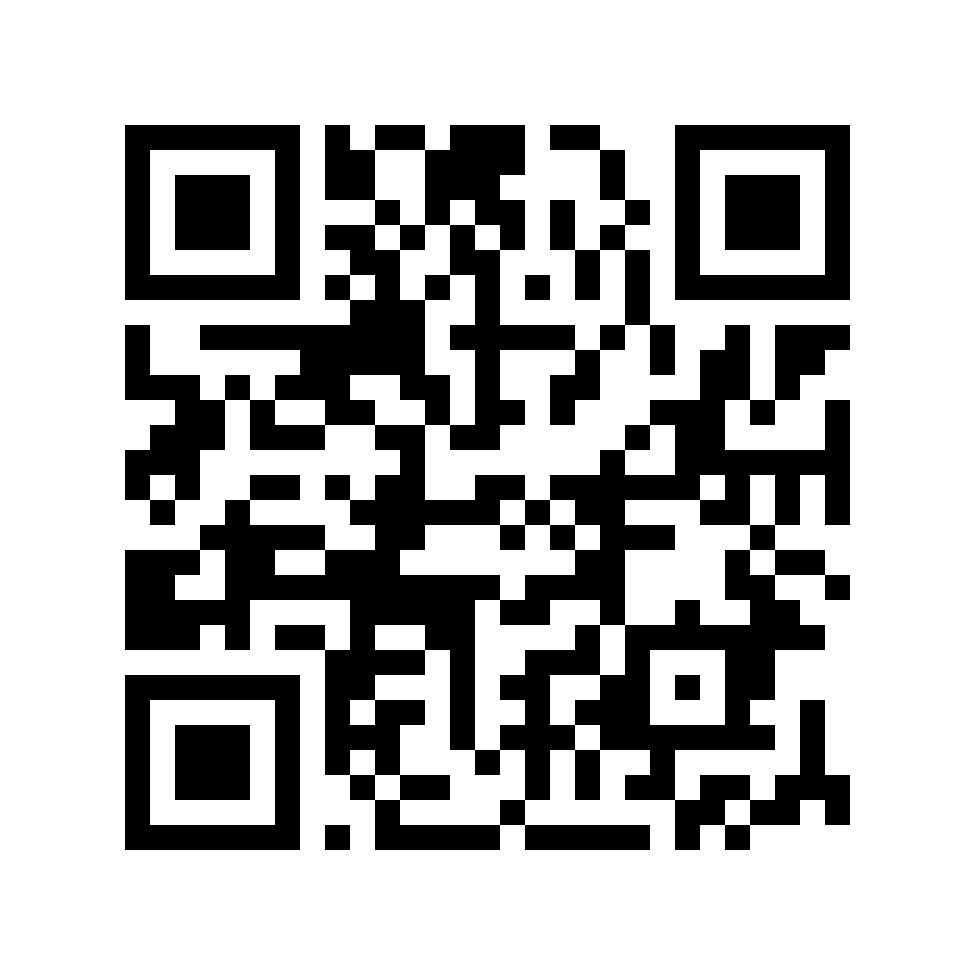

# QR Code Generator

This project is a simple tool to generate QR codes from a specific URL and includes both a web interface and a Flask backend for dynamic QR code generation.

## 🛠️ Features

- Generate QR codes from a provided URL.
- Customizable QR code appearance (size and border).
- Web interface for generating and downloading QR codes.
- Backend server to dynamically generate and return QR codes via API.

---

## 🚀 Installation and Deployment

Follow these steps to set up and deploy the project:

### Frontend Deployment

1. Clone the repository:
   git clone https://github.com/ICaesarI/qr-code-generator.git
   cd qr-code-generator

2. Open the `index.html` file in a browser to access the web interface.

   The web interface includes:
   - A field to input a URL.
   - A button to generate a QR code.
   - An option to download the generated QR code as an image.

---

### Backend Deployment

1. Create and activate a virtual environment (optional but recommended):
   python -m venv .venv
   source .venv/bin/activate  # On Windows: .venv\Scripts\activate

2. Install the required Python packages:
   pip install -r requirements.txt

3. Run the backend server:
   python app.py

4. Access the backend at `http://localhost:5000`. Use the `/generate_qr` endpoint to dynamically create QR codes.

---

## 📋 Example Usage of the Backend

To generate a QR code via API:

1. Make a `POST` request to:
   http://localhost:5000/generate_qr

2. Send the following JSON payload:
   {
       "url": "https://example.com",
       "size": 10,
       "border": 2
   }

3. The server responds with a QR code image. Save or display it as needed.

---

## 📂 Project Structure

```plaintext
qr-code-generator/
├── .gitignore
├── LICENSE
├── README.md
├── index.html
├── page/
│   ├── img/
│   │   ├── github.png
│   │   └── logo.jpg
│   ├── js/
│   │   └── qrcode.js
│   └── style/
│       └── style.css
├── qr_generator/
│   ├── generate_qr.py
│   └── mi_qr.png
└── requirements.txt
```

---

## 📦 Requirements

The project requires the following:
- Python 3.8 or higher.
- Flask (installed via `requirements.txt`).
- A web browser to run the frontend.

---

## 🖼️ QR Code Example


---

## 📧 Contact

If you have any questions or suggestions, feel free to reach out to:
- **Email:** cesar.gonzalez6194@alumnos.udg.mx
- **GitHub:** https://github.com/ICaesarI
